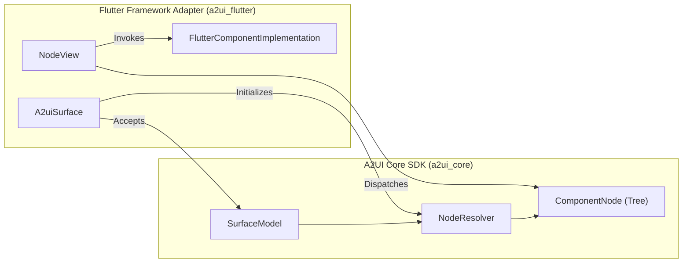

# A2UI Flutter Framework Adapter

The official Flutter framework adapter for A2UI, building directly on the Node API of `a2ui_core`.

Implements protocol **v0.9**.

---

## Architecture Overview

`a2ui_flutter` translates reactive A2UI component trees into native Flutter widgets. It adheres strictly to the [A2UI Framework Adapter Specification](../../blueprints/modules/a2ui_framework_adapter.blueprint.md).



### Key Contracts

1. **`A2uiSurface`**: The public root widget embedded into your Flutter app. Directly accepts a `SurfaceModel<FlutterComponentImplementation>` as its sole input. Manages the lifecycle of `NodeResolver` and injects ambient context (`A2uiSurfaceScope`).
2. **`FlutterComponentImplementation`**: Pairs a component type name and JSON Schema with a Flutter widget builder:
   ```dart
   typedef ChildWidgetBuilder = Widget Function(
     ComponentNode<FlutterComponentImplementation> child,
   );

   class FlutterComponentImplementation extends ComponentApi {
     final Widget Function(
       BuildContext context,
       ComponentNode<FlutterComponentImplementation> node,
       ChildWidgetBuilder buildChild,
     ) builder;
   }
   ```
3. **`NodeView`**: The recursive dispatcher widget keyed by `ValueKey(node.instanceId)`. Subscribes to `node.props` and renders the component or appropriate fallback states (loading placeholder, unknown type warning, cyclic reference indicator).
4. **`NodePropsAccessors`**: Ergonomic typed accessors on `ComponentNode<FlutterComponentImplementation>` (`stringValue`, `boolValue`, `numValue`, `writableBinding`, `action`, `childNodes`, `childNode`).

---

## Basic Catalog Support

The package provides pre-built implementations for standard basic catalog components:
- `Column`
- `Row`
- `Text`
- `Button`
- `TextField` (with two-way data model binding)
- `Card`
- `Divider`

Construct the basic catalog using:
```dart
final catalog = createBasicCatalog();
```

---

## Usage Example

```dart
import 'package:flutter/material.dart';
import 'package:a2ui_flutter/a2ui_flutter.dart';

void main() {
  runApp(const MyApp());
}

class MyApp extends StatelessWidget {
  const MyApp({super.key});

  @override
  Widget build(BuildContext context) {
    // 1. Initialize catalog and processor
    final catalog = createBasicCatalog();
    final processor = MessageProcessor<FlutterComponentImplementation>(
      catalogs: [catalog],
      protocolVersion: A2uiProtocolVersion.v0_9,
    );

    // 2. Process incoming messages (e.g. from agent or stream)
    processor.processMessages(
      AgentToRendererMessagePayload.fromJson(
        {
          'version': 'v0.9',
          'createSurface': {
            'surfaceId': 'main-surface',
            'catalogId': basicCatalogIdV09,
          },
        },
        protocolVersion: A2uiProtocolVersion.v0_9,
      ),
    );

    final surface = processor.groupModel.getSurface('main-surface')!;

    return MaterialApp(
      home: Scaffold(
        body: Center(
          child: A2uiSurface(surface: surface),
        ),
      ),
    );
  }
}
```

---

## Reference Explorer App

See [`samples/client/flutter/a2ui_explorer`](../../samples/client/flutter/a2ui_explorer) for the full 3-column reference gallery and debugging application implementing:
- Scenario navigation
- Interactive stepper (advance message-by-message)
- Live DataModel inspector
- Action logs pane
